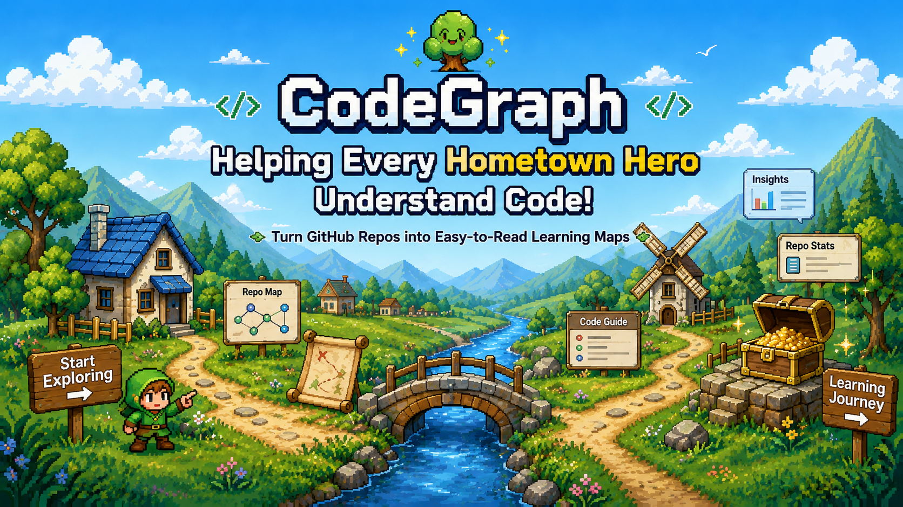
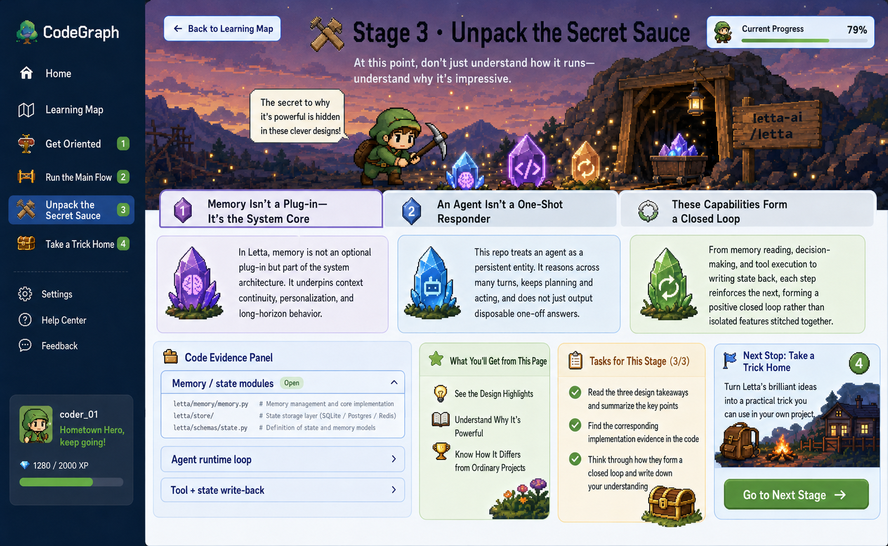
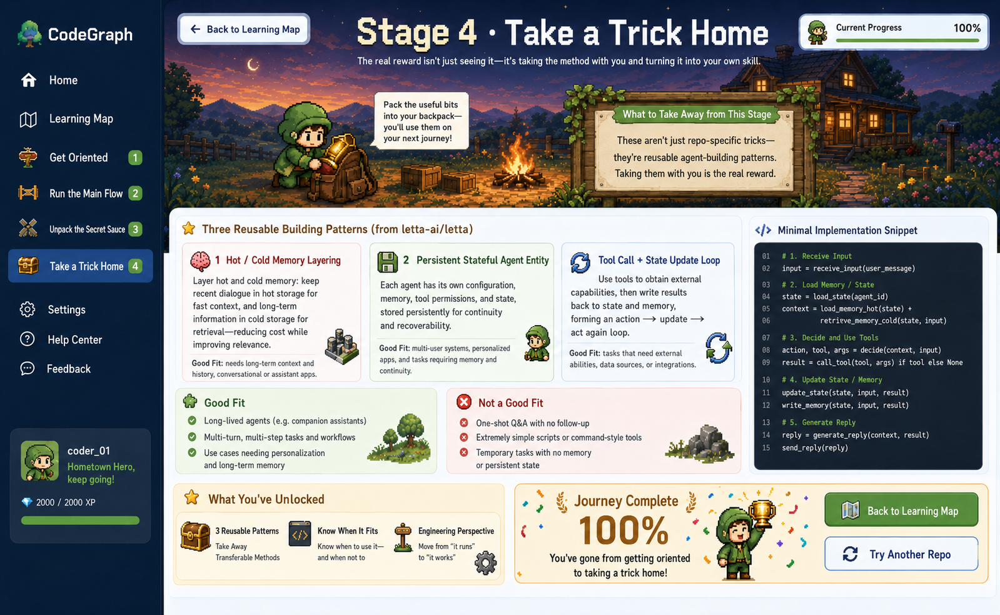

# CodeGraph

<div align="center">
  
  
  <h3>🎮 Turn Complex GitHub Repos into Guided Learning Adventures</h3>
  
  <p>
    
    
    
    
    
  </p>

  <p>
    <a href="./README.md">English</a> · <a href="./README.zh.md">中文</a>
  </p>
</div>

---

## The Problem

You want to learn from **facebook/react** or **langchain-ai/langchain**. You open the repo — 2000+ files stare back at you.

The README explains *how to use it*, not *how to read it*.

Where do you start? Which modules matter? How does the call chain flow? Where's the core design?

**Traditional approaches fall short:**
- Read the README → lost in the file tree
- Search keywords → fragmented understanding, no big picture
- Ask ChatGPT → generic answers that don't know where *you're* stuck

**CodeGraph's answer: Turn repos into guided learning journeys with AI agents leading the way.**

Instead of dumping code into a vector database and hoping for the best, CodeGraph uses a **Multi-Agent orchestration system** to analyze the repo first, then packages structured insights into 4 progressive stages that take you from high-level positioning → running the main flow → dissecting core tricks → extracting reusable patterns.

---

## How It Works: 4-Stage Learning Journey

CodeGraph breaks complex repos into 4 game-like stages you complete in order:

| Stage | Goal | What You Get |
|-------|------|-------------|
| **① Overview** | Build global understanding fast | Project positioning, tech stack, architecture overview, key modules |
| **② Main Flow** | Understand core execution | Entry files, main call chain, key logic breakdown |
| **③ Showcase** | Dissect design worth stealing | Implementation patterns, abstractions, engineering tricks, trade-offs |
| **④ Takeaway** | Extract reusable methods | Practice cards, migration scenarios, code templates |

**This isn't a doc generator. It's a learning path generator.**

---

## Multi-Agent Architecture: Why Not Just RAG?

CodeGraph's core is a **4-stage Agent orchestration system**, not simple RAG Q&A.

### Agent vs RAG

| Dimension | Traditional RAG | CodeGraph Multi-Agent |
|-----------|----------------|----------------------|
| **Workflow** | Query → Retrieve → Generate | Query → **Plan** → **Tool Selection** → **Parallel Execution** → **Context Passing** |
| **Collaboration** | Single-turn, stateless | 4-stage orchestration with explicit context handoff |
| **Parallelism** | None | MainFlow + Showcase run concurrently |
| **Fault Tolerance** | Fails immediately | Error isolation — one Agent failure doesn't block others |
| **Observability** | Black box | Full Trace (tool calls + reasoning + dependency graph) |

### System Architecture

```
User inputs GitHub URL
        ↓
  ┌──────────────┐
  │ Orchestrator │  ← Coordinates 4 Agents, manages context flow
  └──────┬───────┘
         │
    ┌────┴────┐
    ↓         ↓
┌─────────┐ ┌─────────┐
│Overview │ │MainFlow │  ← Parallel execution
│  Agent  │ │  Agent  │
│ Stage ① │ │ Stage ② │
└────┬────┘ └────┬────┘
     │           │
     └─────┬─────┘
           ↓
    context passing
      (architectureSummary → flowNodes)
           │
           ↓
    ┌──────────┐
    │ Showcase │
    │  Agent   │  ← Deep analysis based on prior outputs
    │ Stage ③  │
    └─────┬────┘
          │
          ↓
   ┌──────────┐
   │ Takeaway │
   │  Agent   │  ← Extract reusable methods
   │ Stage ④  │
   └──────────┘
          │
          ↓
      15+ Tools
   (arch detection / call graph /
    pattern matching / test linking...)
```

**Key Features:**
- ✅ **Explicit Orchestration**: OverviewAgent output → downstream Agent input (not implicit prompt concat)
- ✅ **Parallel Speedup**: MainFlow + Showcase run concurrently (40% time saved)
- ✅ **Failure Isolation**: Single stage error → degrades to error stub, others continue
- ✅ **Tool Ecosystem**: 15+ specialized tools (arch detection, call graph tracer, pattern matcher, README summarizer...)
- ✅ **Full Trace**: Records each Agent's reasoning, tool calls, execution time, dependencies

---

## Screenshots

### Homepage: Input Repo, Start Exploring


### Learning Journey Map: 4-Stage Visual Path


### Four Learning Stage Pages

<table>
  <tr>
    <td width="50%">
      
      <p align="center"><strong>① Overview</strong> - Build global understanding</p>
    </td>
    <td width="50%">
      
      <p align="center"><strong>② Main Flow</strong> - Understand execution</p>
    </td>
  </tr>
  <tr>
    <td width="50%">
      
      <p align="center"><strong>③ Showcase</strong> - Dissect core tricks</p>
    </td>
    <td width="50%">
      
      <p align="center"><strong>④ Takeaway</strong> - Extract methods</p>
    </td>
  </tr>
</table>

---

## Technical Highlights

### 1. Multi-Agent Orchestration

```python
# Core orchestration logic
class AnalysisOrchestrator:
    async def analyze_repo(self, repo_url: str) -> dict:
        # Stage 1: Overview
        overview = await self.overview_agent.run(context)
        context["architectureSummary"] = overview["architectureSummary"]
        
        # Stage 2 & 3: Parallel execution
        mainflow, showcase = await asyncio.gather(
            self.mainflow_agent.run(context),
            self.showcase_agent.run(context)
        )
        
        # Stage 4: Takeaway
        context["flowNodes"] = mainflow["flowNodes"]
        context["highlights"] = showcase["highlights"]
        takeaway = await self.takeaway_agent.run(context)
        
        return {
            "overview": overview,
            "mainflow": mainflow,
            "showcase": showcase,
            "takeaway": takeaway,
            "_traces": self._collect_traces()  # Full execution trace
        }
```

### 2. Tool Execution Transparency

Every tool call is tracked:

```python
# Auto-collected stats
tool_stats_collector.record_call(
    tool_name="architecture_detector",
    duration_ms=245.7,
    success=True,
    agent_name="overview"
)

# Query API
GET /api/v1/agent/tools/stats
→ {
    "top_tools": [
        {"tool_name": "fetch_readme", "call_count": 847, "avg_duration_ms": 120.5},
        {"tool_name": "parse_tree", "call_count": 682, "avg_duration_ms": 89.2}
    ],
    "dependency_graph": {
        "architecture_detector": ["fetch_readme", "parse_tree"],
        "call_graph_tracer": ["find_entry_points", "trace_calls"]
    }
}
```

### 3. Graph-Enhanced RAG

Not just vector search — combines graph traversal to understand code structure:

- **Neo4j Knowledge Graph**: Function call chains, dependencies, concept maps
- **Hybrid Retrieval**: Graph traversal + vector similarity + keyword matching
- **Structured Recall**: Prioritizes code "called by current function" over "semantically similar but unrelated"

---

## Quick Start

### Requirements

- Python 3.11+
- Node.js 18+
- Docker & Docker Compose
- Claude API Key (or other OpenAI-compatible API)

### 1. Clone

```bash
git clone https://github.com/liu66-qing/CodeGraph.git
cd CodeGraph
```

### 2. Configure

```bash
cp .env.example .env
# Edit .env, add your API key
```

### 3. Run

```bash
# Start infrastructure (Neo4j + Redis)
docker-compose up -d

# Start backend
pip install -e ".[dev]"
uvicorn codegraph.main:app --reload --port 8000

# Start frontend
cd frontend
npm install
npm run dev
```

Visit `http://localhost:5173`, input a GitHub repo URL, and start exploring.

---

## Project Structure

```
CodeGraph/
├── frontend/              # React + Vite frontend
│   ├── src/pages/         # 6 pages (Home + Map + 4 Stages)
│   └── src/components/    # Pixel UI components
├── src/codegraph/         # FastAPI backend
│   ├── agent/             # Multi-Agent system
│   │   ├── analysis_orchestrator.py   # 4-stage orchestrator
│   │   ├── stages/        # 4 Stage Agents
│   │   ├── tools/         # 15+ specialized tools
│   │   └── tools/stats.py # Tool execution stats
│   ├── api/v1/            # REST API
│   ├── graph/             # Neo4j graph operations
│   ├── retrieval/         # Graph-Enhanced RAG
│   └── ingestion/         # Code parsing & ingestion
├── docs/design/           # PRD + prototypes
└── tests/                 # Unit + integration tests
```

---

## Who Is This For?

- **Learners** - Want to quickly understand large open-source projects (React/Vue/LangChain...)
- **Team Leads** - Want to create learning paths for their team's onboarding
- **Developers** - Want to study Multi-Agent + Graph RAG in code understanding scenarios
- **Researchers** - Want to explore Agent orchestration, tool calling, knowledge graphs in production

---

## Roadmap

- [ ] Support more languages (currently focused on TypeScript/JavaScript/Python)
- [ ] Agent reasoning visualization (real-time Trace rendering)
- [ ] Interactive tool dependency graph explorer
- [ ] Export learning paths (PDF/Markdown)
- [ ] Team collaboration: multiple people learning one repo together

---

## Contributing

We welcome contributions! Whether it's:
- 🐛 Bug reports
- 💡 Feature requests
- 📖 Documentation improvements
- 🔧 Code contributions

Please see our [Contributing Guide](./CONTRIBUTING.md) (coming soon) or open an issue to get started.

---

## License

Apache-2.0 License - See [LICENSE](./LICENSE)

---

<div align="center">
  <p><strong>CodeGraph: Helping Every Hometown Hero Understand Code</strong></p>
  <p>Made with ❤️ by developers who believe great code deserves great guides</p>
  
  ⭐ **Star us if this project helped you learn!**
</div>
