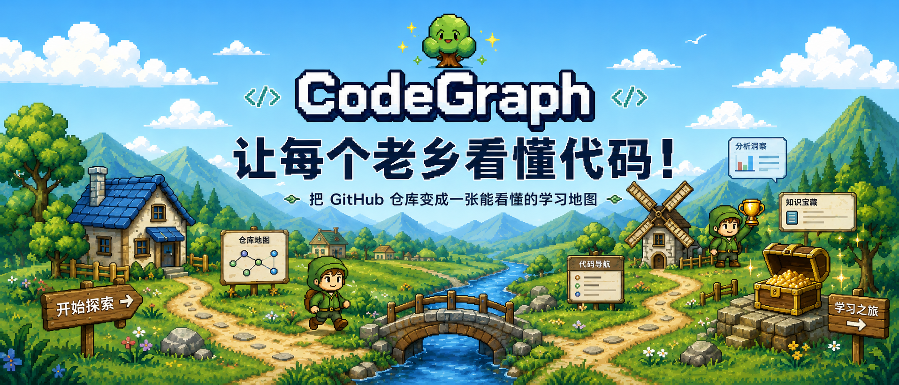

# CodeGraph

<div align="center">
  
  
  **🎮 Transform Complex Repositories into Pixel Game Learning Adventures**
  
  [](LICENSE)
  [](CONTRIBUTING.md)
  
  [English](#english) | [中文](#中文)
</div>

---

<a name="english"></a>

## 🌟 What is CodeGraph?

**CodeGraph** is a pixel game-inspired learning platform that turns intimidating GitHub repositories into guided learning journeys. Instead of drowning in thousands of files, you follow a structured 4-stage path designed by an AI-powered mentor:

1. **先看门道 (Overview)** - Understand the repository's positioning, tech stack, and architecture
2. **跑通主线 (Main Flow)** - Run the project and trace key execution paths
3. **拆它绝活 (Core Tricks)** - Dissect brilliant implementation patterns worth stealing
4. **抄走一招 (Apply It)** - Extract reusable concepts to solve your own problems

### 💡 Why CodeGraph?

Great repositories aren't meant to be brute-forced. They contain years of accumulated wisdom, design patterns, and battle-tested solutions. **CodeGraph makes that wisdom accessible** by:

- 🎯 **Structuring chaos** - Transforms 100k+ lines into a clear learning roadmap
- 🤖 **AI-powered guidance** - Graph-enhanced RAG analyzes code relationships and surfaces insights
- 🎮 **Game-like experience** - Pixel art + progress tracking keeps you motivated
- 📊 **Visual knowledge graphs** - Neo4j-powered dependency and concept mapping
- 🚀 **Production-ready patterns** - Learn by studying real-world, battle-tested code

---

## 🎯 Core Features

### 🗺️ **Learning Path System**
Transform any GitHub repository into a structured 4-stage learning journey. Each stage focuses on a specific learning objective with curated content and guided exploration.

### 🤖 **Graph-Enhanced RAG**
- **Code Comprehension Pipeline**: 6-agent system (type/API/flow/pattern/arch analyzers + orchestrator)
- **Neo4j Knowledge Graph**: Captures function dependencies, call hierarchies, and concept relationships
- **Smart Context Assembly**: Hybrid retrieval combining graph traversal with vector similarity

### 🎨 **Pixel Game Interface**
Stardew Valley-inspired UI with:
- Journey map with interactive stage cards
- Character-driven progress tracking
- Asset-driven pixel art backgrounds
- Smooth animations and hover effects

### 📊 **Repository Analytics**
- Architecture overview with component breakdown
- Tech stack detection and visualization
- Execution flow diagrams
- Core pattern extraction

---

## 🏗️ Architecture

```
┌─────────────────────────────────────────────────────┐
│                    Frontend (React)                 │
│  • Mantine UI + Custom Pixel Components             │
│  • Journey Map, Stage Views, Knowledge Graph Viz    │
└──────────────────┬──────────────────────────────────┘
                   │
┌──────────────────┴──────────────────────────────────┐
│              Backend (FastAPI)                      │
│  ┌─────────────────────────────────────────────┐   │
│  │  Code Comprehension Layer (6 Agents)        │   │
│  │  • TypeAnalyzer  • APIAnalyzer              │   │
│  │  • FlowAnalyzer  • PatternAnalyzer          │   │
│  │  • ArchAnalyzer  • Orchestrator             │   │
│  └─────────────────────────────────────────────┘   │
│                                                      │
│  ┌─────────────────────────────────────────────┐   │
│  │  RAG Pipeline                               │   │
│  │  • Graph Traversal (Neo4j)                  │   │
│  │  • Vector Search (Chroma)                   │   │
│  │  • Hybrid Ranking & Context Assembly        │   │
│  └─────────────────────────────────────────────┘   │
└──────────────────┬──────────────────────────────────┘
                   │
      ┌────────────┴────────────┐
      │                         │
┌─────┴──────┐          ┌──────┴─────┐
│  Neo4j     │          │  ChromaDB  │
│  Graph DB  │          │  Vector DB │
└────────────┘          └────────────┘
```

### Tech Stack

**Frontend**
- React 18 + TypeScript
- Mantine UI (structure) + Custom Pixel Skin (style)
- React Router for stage navigation
- Lucide React for icons
- Vite for build tooling

**Backend**
- FastAPI (Python 3.11+)
- LangChain for LLM orchestration
- Neo4j for knowledge graph
- ChromaDB for vector embeddings
- Tree-sitter for code parsing

**Infrastructure**
- Docker + Docker Compose
- GitHub API integration
- Claude API for AI comprehension

---

## 🚀 Getting Started

### Prerequisites

- Node.js 18+
- Python 3.11+
- Docker & Docker Compose
- Neo4j instance (or use Docker)
- Claude API key

### Installation

1. **Clone the repository**
```bash
git clone https://github.com/liu66-qing/CodeGraph.git
cd CodeGraph
```

2. **Set up environment variables**
```bash
# Backend
cp backend/.env.example backend/.env
# Edit backend/.env and add your Claude API key
```

3. **Start infrastructure**
```bash
docker-compose up -d
```

4. **Install frontend dependencies**
```bash
cd frontend
npm install
```

5. **Install backend dependencies**
```bash
cd backend
pip install -r requirements.txt
```

6. **Run the application**

Terminal 1 (Backend):
```bash
cd backend
uvicorn main:app --reload --port 8000
```

Terminal 2 (Frontend):
```bash
cd frontend
npm run dev
```

Visit `http://localhost:5173` to start exploring repositories!

---

## 📖 Usage

1. **Paste a GitHub repository URL** (e.g., `facebook/react`)
2. **Wait for analysis** - CodeGraph will:
   - Clone and parse the repository
   - Build a knowledge graph of dependencies
   - Generate embeddings for semantic search
   - Run the 6-agent comprehension pipeline
3. **Follow the learning path**:
   - Stage 1: Get the big picture
   - Stage 2: Trace execution flows
   - Stage 3: Study implementation patterns
   - Stage 4: Extract reusable techniques
4. **Chat with the codebase** - Ask questions at any stage

---

## 🎨 Design Philosophy

### Asset-Driven Art Direction
CodeGraph's pixel art style is built on licensed asset packs, not CSS tricks:
- **Ansimuz Sunny Land** - Colorful village scenes
- **Kenney Pixel Characters** - Sprite sheets for the mentor
- Custom-composed backgrounds for hero & journey map

### Game-Like Learning
- Progress tracking with XP and milestones
- Stage cards as signposts on a journey map
- Visual feedback for completed stages
- Mentor character guidance throughout

### Graph-First Architecture
Unlike pure RAG systems, CodeGraph:
- **Understands relationships** - Function calls, imports, inheritance
- **Preserves structure** - Graph traversal before vector search
- **Surfaces connections** - Shows how concepts relate, not just definitions

---

## 🤝 Contributing

We welcome contributions! Please see [CONTRIBUTING.md](CONTRIBUTING.md) for guidelines.

Key areas where we need help:
- 📊 Additional repository analytics
- 🎨 More pixel art assets and themes
- 🌐 Support for more languages (currently focused on TypeScript/JavaScript)
- 🧪 Test coverage improvements
- 📝 Documentation and tutorials

---

## 📄 License

This project is licensed under the MIT License - see [LICENSE](LICENSE) for details.

---

## 🙏 Acknowledgments

- **Asset Packs**: Ansimuz (Sunny Land), Kenney (Pixel Characters, Voxel Pack)
- **Inspiration**: Stardew Valley's cozy game aesthetic
- **Tech**: Built with Anthropic Claude, LangChain, Neo4j, and modern web stack

---

<a name="中文"></a>

## 🌟 CodeGraph 是什么？

**CodeGraph** 是一个像素游戏风格的代码学习平台,将复杂的 GitHub 仓库转化为结构化的学习旅程。不再迷失在成千上万的文件中,而是跟随 AI 导师设计的 4 阶段学习路径:

1. **先看门道** - 了解仓库定位、技术栈和整体架构
2. **跑通主线** - 运行项目并追踪关键执行流程
3. **拆它绝活** - 拆解值得学习的核心实现模式
4. **抄走一招** - 提炼可复用的思路解决自己的问题

### 💡 为什么选择 CodeGraph?

优秀的仓库不是用来硬啃的,它们凝聚了多年的智慧、设计模式和久经考验的解决方案。**CodeGraph 让这些智慧变得触手可及**:

- 🎯 **结构化混沌** - 将 10 万行代码转化为清晰的学习路线图
- 🤖 **AI 导师指导** - 图增强 RAG 分析代码关系并提炼洞察
- 🎮 **游戏化体验** - 像素风 + 进度追踪让学习更有趣
- 📊 **可视化知识图谱** - Neo4j 驱动的依赖和概念关系映射
- 🚀 **生产级模式** - 从真实项目中学习经过实战检验的代码

---

## 🎯 核心功能

### 🗺️ **学习路径系统**
将任何 GitHub 仓库转化为结构化的 4 阶段学习旅程。每个阶段专注于特定的学习目标,提供精选内容和引导式探索。

### 🤖 **图增强 RAG**
- **代码理解流水线**: 6-agent 系统 (类型/API/流程/模式/架构分析器 + 编排器)
- **Neo4j 知识图谱**: 捕获函数依赖、调用层次和概念关系
- **智能上下文组装**: 图遍历与向量相似度的混合检索

### 🎨 **像素游戏界面**
星露谷风格 UI,包含:
- 交互式阶段卡片的旅程地图
- 角色驱动的进度追踪
- 资源驱动的像素艺术背景
- 流畅的动画和悬停效果

### 📊 **仓库分析**
- 组件拆解的架构概览
- 技术栈检测与可视化
- 执行流程图
- 核心模式提取

---

## 🚀 快速开始

### 环境要求

- Node.js 18+
- Python 3.11+
- Docker & Docker Compose
- Neo4j 实例 (或使用 Docker)
- Claude API 密钥

### 安装步骤

1. **克隆仓库**
```bash
git clone https://github.com/liu66-qing/CodeGraph.git
cd CodeGraph
```

2. **配置环境变量**
```bash
# 后端
cp backend/.env.example backend/.env
# 编辑 backend/.env 并添加你的 Claude API 密钥
```

3. **启动基础设施**
```bash
docker-compose up -d
```

4. **安装前端依赖**
```bash
cd frontend
npm install
```

5. **安装后端依赖**
```bash
cd backend
pip install -r requirements.txt
```

6. **运行应用**

终端 1 (后端):
```bash
cd backend
uvicorn main:app --reload --port 8000
```

终端 2 (前端):
```bash
cd frontend
npm run dev
```

访问 `http://localhost:5173` 开始探索仓库!

---

## 📖 使用方法

1. **粘贴 GitHub 仓库地址** (例如 `facebook/react`)
2. **等待分析** - CodeGraph 将会:
   - 克隆并解析仓库
   - 构建依赖关系的知识图谱
   - 生成语义搜索的嵌入向量
   - 运行 6-agent 理解流水线
3. **跟随学习路径**:
   - 阶段 1: 建立全局认知
   - 阶段 2: 追踪执行流程
   - 阶段 3: 学习实现模式
   - 阶段 4: 提炼可复用技巧
4. **与代码库对话** - 在任何阶段提问

---

## 🎨 设计理念

### 资源驱动的艺术方向
CodeGraph 的像素风格基于授权资源包构建,而非 CSS 技巧:
- **Ansimuz Sunny Land** - 彩色村庄场景
- **Kenney 像素角色** - 导师精灵图
- 自定义合成的英雄区和旅程地图背景

### 游戏化学习
- 带有 XP 和里程碑的进度追踪
- 旅程地图上作为路标的阶段卡片
- 完成阶段的视觉反馈
- 导师角色全程指导

### 图优先架构
与纯 RAG 系统不同,CodeGraph:
- **理解关系** - 函数调用、导入、继承
- **保持结构** - 图遍历优先于向量搜索
- **揭示连接** - 展示概念之间的关系,而非仅仅是定义

---

## 🤝 贡献

我们欢迎贡献!请查看 [CONTRIBUTING.md](CONTRIBUTING.md) 了解指南。

需要帮助的关键领域:
- 📊 额外的仓库分析功能
- 🎨 更多像素艺术资源和主题
- 🌐 支持更多语言 (目前专注于 TypeScript/JavaScript)
- 🧪 测试覆盖率改进
- 📝 文档和教程

---

## 📄 许可证

本项目采用 MIT 许可证 - 详见 [LICENSE](LICENSE)。

---

## 🙏 致谢

- **资源包**: Ansimuz (Sunny Land)、Kenney (像素角色、体素包)
- **灵感来源**: 星露谷的温馨游戏美学
- **技术栈**: 基于 Anthropic Claude、LangChain、Neo4j 和现代 Web 技术栈构建

---

<div align="center">
  Made with ❤️ by the CodeGraph team
  
  ⭐ Star us on GitHub if this project helped you!
</div>
