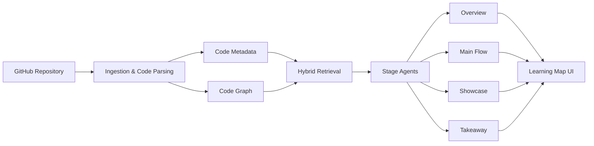

# CodeGraph

<div align="center">
  

  <h3>Stop wandering through giant repos. Turn any GitHub codebase into a guided learning map.</h3>

  <p>
    <a href="./README.zh.md">中文</a> ·
    <a href="https://code-graph-five.vercel.app/">Live Demo</a> ·
    <a href="https://code-graph-five.vercel.app/map">Learning Map</a> ·
    <a href="#contributing">Contribute</a>
  </p>

  <p>
    
    
    
    
    
    
  </p>
</div>

## Why This Exists

Large open-source repositories are full of hard-won engineering wisdom, but most developers never get past the file tree.

You open `react`, `vscode`, or `langchain`, and the same questions show up:

- Where should I start?
- Which files actually matter?
- How does the main execution flow work?
- What design tricks are worth learning?
- How do I turn this repo into something I can contribute to?

Traditional code search gives you fragments. A normal README tells you how to use the project, not how to read it.

**CodeGraph turns a repository into a staged learning journey: overview first, main flow second, implementation tricks third, reusable takeaways last.**

If that sounds useful, please consider giving the repo a star. It helps more developers discover the project, and it tells me which direction is worth building next.

## What CodeGraph Does

CodeGraph is an AI codebase learning assistant. Paste a GitHub repository URL, and it helps you explore the project like a guided map instead of a raw file tree.

| Stage | Question It Answers | Output |
| --- | --- | --- |
| **1. Overview** | What is this repo, and how is it organized? | Positioning, tech stack, module map, architecture summary |
| **2. Main Flow** | How does the core path run? | Entry points, call flow, key logic, execution route |
| **3. Showcase** | What implementation ideas are worth stealing? | Patterns, abstractions, design highlights, tradeoffs |
| **4. Takeaway** | What can I reuse in my own project? | Practice cards, migration ideas, reusable mental models |

It is not trying to be another generic chatbot over code. The goal is sharper:

> Help developers understand unfamiliar repositories fast enough to learn from them, modify them, and contribute back.

## Demo

Try the hosted frontend:

- [Live Demo](https://code-graph-five.vercel.app/)
- [Learning Map](https://code-graph-five.vercel.app/map)

Note: the public demo currently focuses on the frontend experience. Full repository analysis, graph retrieval, and AI Q&A require running the backend services locally.

## Screenshots

### Home


### Learning Map


### Stage Pages

<table>
  <tr>
    <td width="50%">
      
      <p align="center"><strong>Overview</strong></p>
    </td>
    <td width="50%">
      
      <p align="center"><strong>Main Flow</strong></p>
    </td>
  </tr>
  <tr>
    <td width="50%">
      
      <p align="center"><strong>Showcase</strong></p>
    </td>
    <td width="50%">
      
      <p align="center"><strong>Takeaway</strong></p>
    </td>
  </tr>
</table>

## Why It Is Different From Basic RAG

Most code RAG demos do this:

```text
chunk files -> embed chunks -> retrieve similar text -> answer
```

That is useful, but it misses structure. Code is not just text. Code has modules, call chains, dependencies, entry points, tests, and architectural boundaries.

CodeGraph is designed around structured understanding:

- **Graph-aware retrieval**: combines semantic search with code relationships.
- **Stage-specific agents**: overview, main flow, showcase, and takeaway each ask different questions.
- **Learning-first output**: optimized for onboarding and understanding, not just isolated Q&A.
- **Visual journey UI**: the repo becomes a path you can follow, not a wall of folders.

## Architecture



## Tech Stack

| Layer | Stack |
| --- | --- |
| Frontend | React, TypeScript, Vite, Mantine, pixel-style UI |
| Backend | FastAPI, Python 3.11 |
| Retrieval | Hybrid retrieval, vector search, keyword retrieval |
| Graph | Neo4j-style code relationship modeling |
| Agent layer | Stage agents, orchestration, structured outputs |
| DevOps | Docker Compose, Vercel-ready frontend |

## Quick Start

### Requirements

- Python 3.11+
- Node.js 18+
- Docker and Docker Compose
- An OpenAI-compatible API key

### Clone

```bash
git clone https://github.com/liu66-qing/CodeGraph.git
cd CodeGraph
```

### Configure

```bash
cp .env.example .env
```

Edit `.env` with your model and service settings.

### Start Infrastructure

```bash
docker-compose up -d
```

### Start Backend

```bash
pip install -e ".[dev]"
uvicorn evograph.main:app --reload --host 0.0.0.0 --port 8000
```

### Start Frontend

```bash
cd frontend
npm install
npm run dev
```

Open `http://localhost:5173`.

## Project Structure

```text
.
├── frontend/              # React + Vite frontend
├── src/evograph/          # FastAPI, agents, RAG, graph, ingestion
├── tests/                 # Unit and integration tests
├── docs/                  # Design docs, screenshots, README assets
├── alembic/               # Database migrations
├── docker-compose.yml     # Local infrastructure
└── pyproject.toml         # Python project metadata
```

## Roadmap

- [ ] Better support for large TypeScript / Python repositories
- [ ] More accurate call-chain and module relationship extraction
- [ ] GitHub issue and PR context analysis
- [ ] Exportable learning reports in Markdown / PDF
- [ ] Public backend deployment for end-to-end hosted demos
- [ ] More examples from real-world open-source projects

## Contributing

CodeGraph is early, and the best contributions right now are concrete and practical:

- Star the project if the idea resonates.
- Open an issue with a repo you want CodeGraph to understand better.
- Suggest a better learning-stage design.
- Contribute analyzers for new languages or frameworks.
- Improve prompts, screenshots, docs, or onboarding.

Good first issues to propose:

- "Add support for analyzing Next.js App Router repos"
- "Improve call flow extraction for FastAPI projects"
- "Add a sample analysis for LangChain"
- "Export learning path as Markdown"

## License

Apache-2.0. See [LICENSE](./LICENSE).

---

<div align="center">
  <strong>If CodeGraph helps you read one scary repo faster, please leave a star.</strong>
  <br>
  Stars, issues, and PRs are the signal that this should keep growing.
</div>
