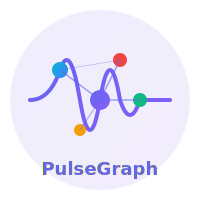
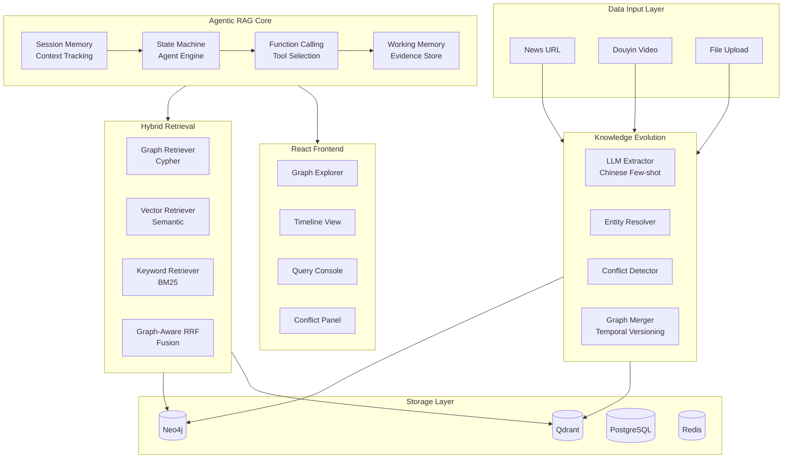
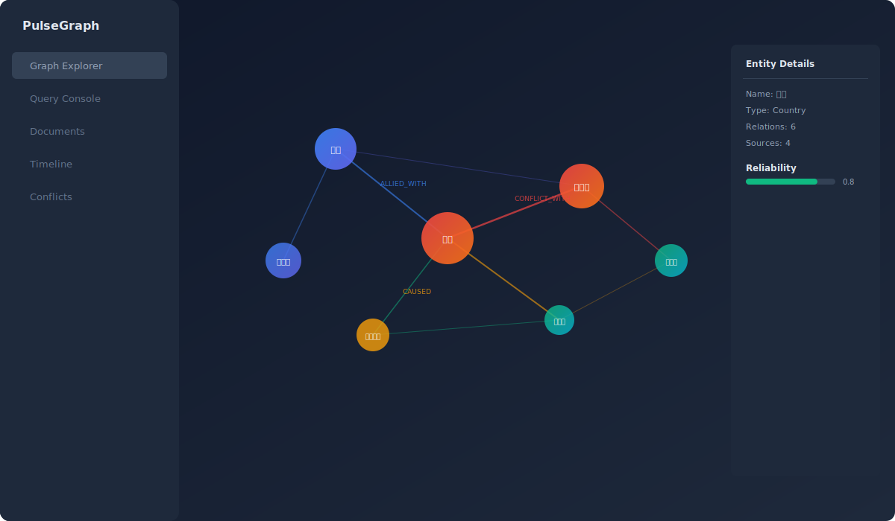
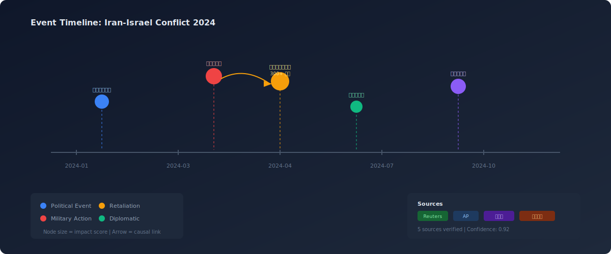
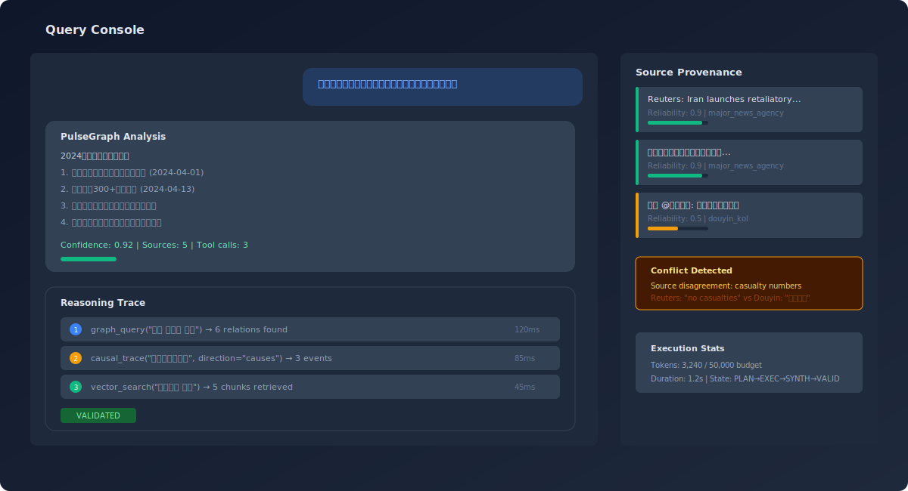

<p align="center">
  
</p>

<h1 align="center">PulseGraph</h1>
<h3 align="center">Multi-Source Information Pulse Graph Intelligence Analysis System</h3>

<p align="center">
  <em>Automatically build event timelines and relationship graphs from fragmented multi-source information</em>
</p>

<p align="center">
  <a href="#"></a>
  <a href="#"></a>
  <a href="#"></a>
  <a href="#"></a>
  <a href="#"></a>
  <a href="#"></a>
</p>

<p align="center">
  <a href="#features">Features</a> &bull;
  <a href="#architecture">Architecture</a> &bull;
  <a href="#quick-start">Quick Start</a> &bull;
  <a href="#demo">Demo</a> &bull;
  <a href="#api-reference">API</a> &bull;
  <a href="#tech-stack">Tech Stack</a>
</p>

---

## What is PulseGraph?

PulseGraph is an **Agentic RAG system** that goes beyond traditional document Q&A. Given a news article, video link, or any text input, it automatically:

1. **Extracts** entities and relationships using LLM-powered Chinese NLP
2. **Searches** for related sources to build a complete picture
3. **Constructs** a knowledge graph with temporal versioning
4. **Detects** information conflicts across multiple sources
5. **Visualizes** relationship networks, event timelines, and causal chains
6. **Answers** questions with full provenance and reasoning traces

```
User Input (news URL / Douyin video / text)
    │
    ▼
┌─────────────────────────────────────────────────────────┐
│  Content Extraction (URL scraping / ASR transcription)  │
└─────────────────────────────────────────────────────────┘
    │
    ▼
┌─────────────────────────────────────────────────────────┐
│  Active Information Completion (multi-round search)      │
│  → Relevance scoring → Saturation detection → Stop      │
└─────────────────────────────────────────────────────────┘
    │
    ▼
┌─────────────────────────────────────────────────────────┐
│  Knowledge Graph Evolution Pipeline                      │
│  Extract → Resolve → Conflict Detect → Merge → Notify   │
└─────────────────────────────────────────────────────────┘
    │
    ▼
┌─────────────────────────────────────────────────────────┐
│  Interactive Visualization                               │
│  Force Graph + Timeline + Causal DAG + Conflict Panel    │
└─────────────────────────────────────────────────────────┘
```

---

<a name="features"></a>
## Key Features

### Multi-Source Input
| Input Type | Method | Status |
|-----------|--------|--------|
| News URL | Web scraping + content extraction | Ready |
| Douyin Video | yt-dlp metadata + ASR transcription | Ready |
| File Upload | PDF / TXT / Markdown parsing | Ready |
| Plain Text | Direct pipeline processing | Ready |

### Intelligent Agent (Agentic RAG)
- **Function Calling Protocol** — Tools defined via JSON Schema, LLM selects tools structurally
- **Explicit State Machine** — Planning → Executing → Synthesizing → Validating → Replanning
- **Structured Working Memory** — Typed evidence (graph facts, text chunks, temporal facts, conflicts)
- **Token Budget Control** — Hard limit prevents runaway costs
- **Session Memory** — Multi-turn conversation with coreference resolution

### Knowledge Graph Evolution
- **Chinese NLP Extraction** — Few-shot prompted, scene-adaptive (geopolitics, entertainment, fiction)
- **Temporal Versioning** — Every relation carries `valid_from` / `valid_to`
- **Three-Type Conflict Detection** — Temporal overlap, logical contradiction, source disagreement
- **Source Reliability Scoring** — Official (0.95) → Major media (0.9) → KOL (0.5) → Personal (0.4)

### Visualization
- **Force-Directed Graph** — Entity relationship network with D3.js
- **Event Timeline** — Chronological event progression
- **Causal DAG** — Directed acyclic graph of cause-effect chains
- **Conflict Dashboard** — Multi-source contradiction management

---

<a name="architecture"></a>
## Architecture



### Agent State Machine

```
┌──────────┐     ┌───────────┐     ┌──────────────┐     ┌────────────┐
│ PLANNING │────▶│ EXECUTING │────▶│ SYNTHESIZING │────▶│ VALIDATING │
└──────────┘     └───────────┘     └──────────────┘     └────────────┘
                       ▲                                       │
                       │              ┌─────────────┐          │
                       └──────────────│ REPLANNING  │◀─────────┘
                                      └─────────────┘    (if invalid)
```

---

<a name="demo"></a>
## Demo

### Graph Explorer
Interactive force-directed graph showing entity relationships with color-coded node types and confidence-weighted edges.



### Event Timeline
Chronological view of events with causal connections and source annotations.



### Query Console
AI-powered Q&A with full reasoning trace, tool call history, and source provenance.



---

<a name="quick-start"></a>
## Quick Start

### Prerequisites
- Python 3.11+
- Node.js 18+
- Docker & Docker Compose

### 1. Clone and Setup

```bash
git clone https://github.com/liu66-qing/-PulseGraph.git
cd -PulseGraph
```

### 2. Start Infrastructure

```bash
docker-compose up -d   # Neo4j + PostgreSQL + Redis
```

### 3. Configure Environment

```bash
cp .env.example .env
# Edit .env with your API keys:
#   LLM_API_KEY=your-deepseek-key
#   EMBED_API_KEY=your-dashscope-key
```

### 4. Install & Run Backend

```bash
pip install -e ".[dev]"
make run
```

### 5. Install & Run Frontend

```bash
cd frontend && npm install && npm run dev
```

### 6. Start Async Worker

```bash
make worker
```

Visit http://localhost:5173 to start exploring.

---

<a name="api-reference"></a>
## API Reference

Full Swagger docs available at `http://localhost:8080/docs` after starting the backend.

### Core Endpoints

| Method | Endpoint | Description |
|--------|----------|-------------|
| `POST` | `/api/v1/documents` | Upload document → trigger evolution pipeline |
| `POST` | `/api/v1/documents/url` | Ingest from news URL |
| `POST` | `/api/v1/documents/douyin` | Ingest from Douyin video link |
| `POST` | `/api/v1/query` | Intelligent Q&A with reasoning trace |
| `POST` | `/api/v1/query/stream` | SSE streaming response |
| `GET` | `/api/v1/graph/entities` | Search entities |
| `GET` | `/api/v1/graph/entities/{id}/neighborhood` | N-hop subgraph |
| `GET` | `/api/v1/conflicts` | List knowledge conflicts |
| `POST` | `/api/v1/conflicts/{id}/resolve` | Resolve a conflict |
| `GET` | `/api/v1/timeline/snapshot` | Graph state at time T |
| `WS` | `/ws/graph/updates` | Real-time graph evolution notifications |

---

<a name="tech-stack"></a>
## Tech Stack

| Layer | Technology | Purpose |
|-------|-----------|---------|
| **Backend** | Python 3.11, FastAPI, Celery | Async API + task processing |
| **LLM** | DeepSeek / OpenAI-compatible | Entity extraction, reasoning, synthesis |
| **Embedding** | DashScope text-embedding-v3 | Semantic vector search |
| **Graph DB** | Neo4j 5.x | Knowledge graph storage & traversal |
| **Vector DB** | Qdrant | Semantic similarity retrieval |
| **RDBMS** | PostgreSQL 16 | Metadata & audit logs |
| **Cache** | Redis 7 | Caching, message queue, pub/sub |
| **Frontend** | React 18, TypeScript, Vite | User interface |
| **Visualization** | D3.js | Interactive force-directed graphs |
| **Styling** | TailwindCSS | Responsive UI |
| **Observability** | structlog, OpenTelemetry | Structured logging & tracing |

---

## Project Structure

```
PulseGraph/
├── src/evograph/
│   ├── agent/                  # Agentic RAG core
│   │   ├── engine.py           # State machine + Function Calling
│   │   ├── orchestrator.py     # Adaptive reasoning loop
│   │   ├── memory.py           # Session memory system
│   │   ├── search_strategy.py  # Active information completion
│   │   └── tools/              # Tool registry
│   ├── evolution/              # Knowledge graph evolution
│   │   ├── pipeline.py         # Full evolution pipeline
│   │   ├── extractor.py        # LLM extraction (Chinese, few-shot)
│   │   ├── conflict_detector.py # 3-type conflict detection
│   │   └── merger.py           # Temporal versioning merge
│   ├── retrieval/              # Hybrid retrieval
│   │   ├── hybrid.py           # Graph-aware RRF fusion
│   │   ├── graph_retriever.py  # Cypher generation
│   │   └── vector_retriever.py # Semantic search
│   ├── ingestion/              # Multi-source input
│   │   ├── url_loader.py       # News URL scraping
│   │   ├── douyin_loader.py    # Douyin video + ASR
│   │   └── loader.py           # File loading & chunking
│   ├── prompts/                # YAML prompt templates
│   │   └── extraction/         # Scene-adaptive few-shot
│   ├── observability/          # Tracing & metrics
│   └── api/v1/                 # REST endpoints
├── frontend/                   # React + D3.js frontend
├── tests/                      # Unit & integration tests
├── docker-compose.yml          # Infrastructure services
└── docs/                       # Documentation & assets
```

---

## Testing

```bash
# Run all tests
make test

# Unit tests only
make test-unit

# With coverage report
python -m pytest tests/ --cov=src/evograph --cov-report=html
```

Current test coverage includes:
- `RobustJsonParser` — Malformed JSON recovery
- `RelevanceScorer` — Multi-dimensional relevance scoring
- `SaturationDetector` — Information saturation stop conditions
- `DouyinLoader` — Text merging and reliability calculation
- `SessionMemory` — Coreference resolution and context tracking
- `ConflictDetector` — Three conflict type detection

---

## Comparison with Traditional RAG

| Dimension | Traditional RAG | PulseGraph |
|-----------|----------------|------------|
| Knowledge Representation | Document chunks + vectors | **Knowledge graph + temporal versions + vectors** |
| Retrieval | Single-path vector search | **3-way graph-aware fusion (graph + vector + keyword)** |
| Reasoning | Single LLM call | **Multi-step agent with state machine and tool calling** |
| Time Awareness | None | **Temporal versioning, time-travel queries** |
| Conflict Handling | None | **3-type automatic detection + human resolution** |
| Source Tracking | None | **Full provenance with reliability scoring** |
| Multi-source Input | File upload only | **URL + Video (ASR) + File + Active search** |

---

## Contributing

1. Fork the repository
2. Create your feature branch (`git checkout -b feature/amazing-feature`)
3. Run tests (`make test`)
4. Commit your changes
5. Push to the branch and open a Pull Request

---

## License

This project is licensed under the Apache License 2.0 - see the [LICENSE](LICENSE) file for details.

</content>
</invoke>