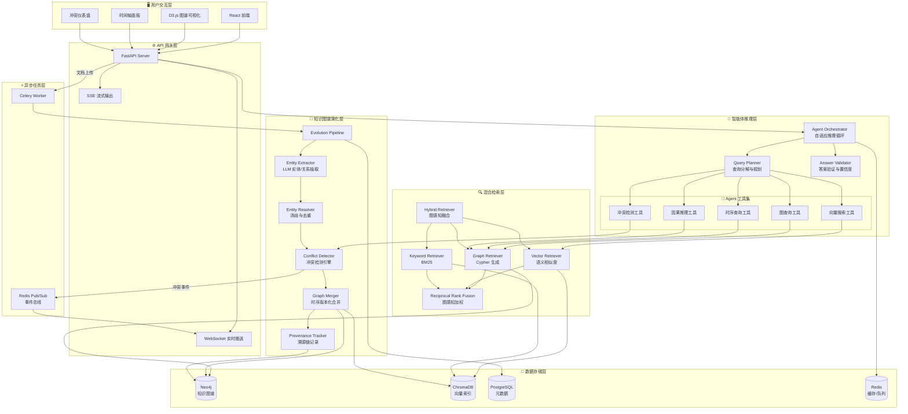
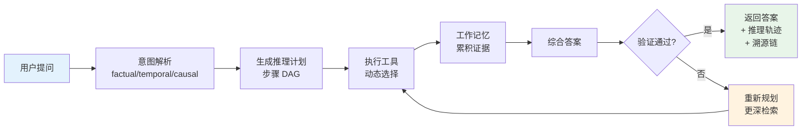
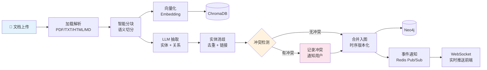
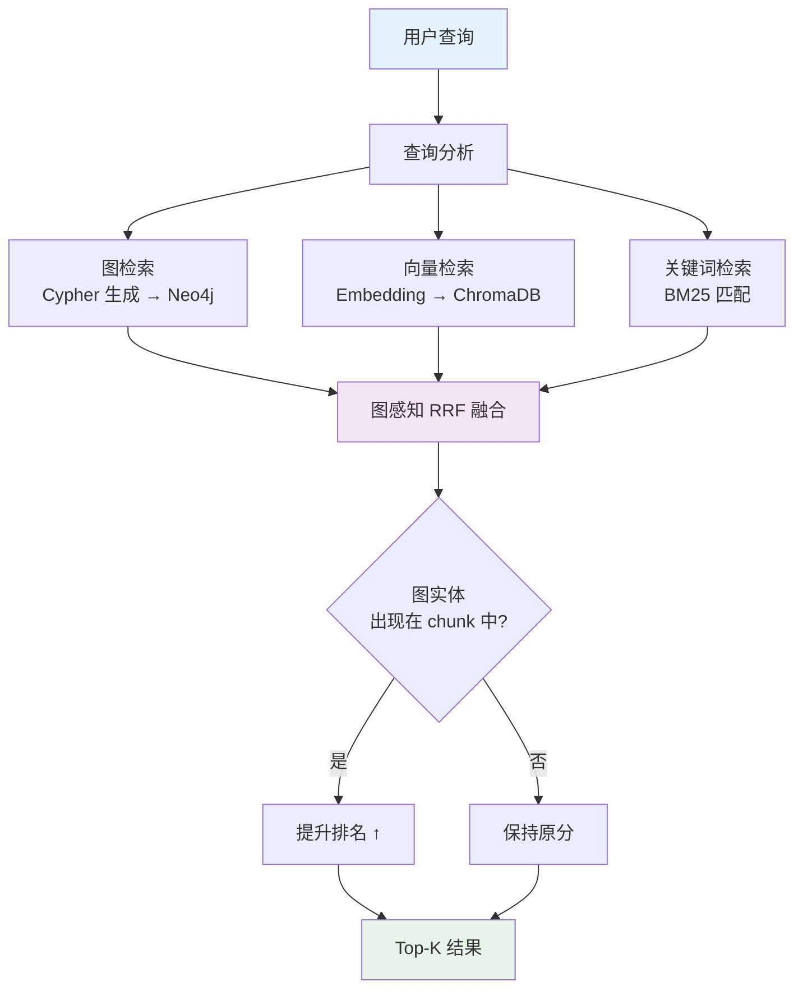
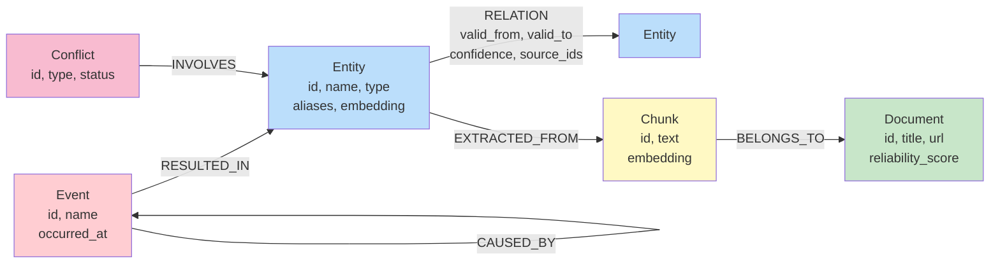

<p align="center">
  
</p>

<h1 align="center">EvoGraph - 实时知识图谱演化智能体</h1>

<p align="center">
  <strong>Agentic RAG × 动态知识图谱 × 时序推理 × 冲突检测</strong>
</p>

<p align="center">
  <a href="#快速开始">快速开始</a> •
  <a href="#系统架构">系统架构</a> •
  <a href="#核心创新">核心创新</a> •
  <a href="#api-文档">API 文档</a> •
  <a href="#技术栈">技术栈</a>
</p>

---

## 项目简介

EvoGraph 是一个**生产级 Agentic RAG 系统**，将传统 RAG 的"文档分块 → 向量检索 → 生成回答"模式，升级为：

```
文档 → 知识图谱自动构建 → 时序版本化 → 冲突检测 → 多跳推理 → 溯源回答
```

与传统 RAG 不同，EvoGraph 将知识视为**活的、演化的图谱**，而非静态的文档碎片。

---

## 系统架构

### 整体架构总览



### Agent 自适应推理循环



### 知识图谱演化流水线



### 混合检索与图感知融合



### Neo4j 知识图谱数据模型



---

## 核心创新

| # | 创新点 | 说明 |
|---|--------|------|
| 1 | **自适应推理循环** | 非固定流水线，Agent 动态选择工具（图查询/向量搜索/时序查询/因果推理/冲突检测），可回溯重规划，最多 5 轮迭代直到置信度达标 |
| 2 | **时序知识版本化** | 每条关系携带 `valid_from`/`valid_to` 时间窗口，支持"时间旅行"查询、图谱快照对比、时间线回放 |
| 3 | **三类冲突自动检测** | 时序重叠（同一角色多人）、逻辑矛盾（互斥关系）、来源分歧（多源不一致），检测后通知用户裁决 |
| 4 | **因果链推理** | 维护 Event 节点间的因果边，支持 "为什么X发生" 和 "如果Y会怎样" 类问题 |
| 5 | **图感知混合检索** | 三路检索（图/向量/关键词）通过图感知 RRF 融合——chunk 中提到图检索命中的实体时获得排名提升 |
| 6 | **溯源置信度评分** | 每个回答的每条事实都可追溯到原始文档片段，置信度由来源可靠性、时间新鲜度、多源佐证度综合计算 |
| 7 | **实时图谱演化** | 文档上传触发异步流水线（Celery），新知识实时合并入图，WebSocket 推送前端更新 |

---

## 技术栈

| 层级 | 技术 | 用途 |
|------|------|------|
| 后端框架 | Python 3.11+, FastAPI | 异步 API 服务 |
| 智能体 | LangChain, OpenAI API | LLM 调用与推理编排 |
| 图数据库 | Neo4j 5.x | 知识图谱存储与遍历 |
| 向量数据库 | ChromaDB | 语义相似度检索 |
| 关系数据库 | PostgreSQL 16 | 元数据与审计日志 |
| 缓存/队列 | Redis + Celery | 缓存、消息队列、异步任务 |
| 前端 | React 18 + TypeScript | 用户界面 |
| 可视化 | D3.js | 交互式力导向图谱 |
| 样式 | TailwindCSS | UI 样式 |
| 容器化 | Docker Compose | 一键部署依赖服务 |

---

## 快速开始

### 环境要求

- Python 3.11+
- Node.js 18+
- Docker & Docker Compose

### 1. 克隆项目

```bash
git clone https://github.com/liu66-qing/KG-RAG-Agent.git
cd KG-RAG-Agent
```

### 2. 启动依赖服务

```bash
docker-compose up -d
```

这将启动 Neo4j、PostgreSQL、Redis、ChromaDB 四个服务。

### 3. 配置环境变量

```bash
cp .env.example .env
# 编辑 .env，填入你的 OPENAI_API_KEY
```

### 4. 安装后端依赖

```bash
pip install -e ".[dev]"
```

### 5. 启动后端服务

```bash
make run
# 或: uvicorn src.evograph.main:app --reload --port 8080
```

### 6. 启动前端

```bash
cd frontend
npm install
npm run dev
```

### 7. 启动异步 Worker

```bash
make worker
```

访问 http://localhost:5173 开始使用。

---

## 项目结构

```
KG-RAG-Agent/
├── docker-compose.yml          # Neo4j + PostgreSQL + Redis + ChromaDB
├── pyproject.toml              # Python 项目配置
├── Makefile                    # 开发命令
├── frontend/                   # React 前端
│   └── src/
│       ├── pages/              # 5 个核心页面
│       │   ├── GraphExplorer   # D3.js 交互式图谱
│       │   ├── QueryConsole    # 智能问答 + 推理轨迹
│       │   ├── DocumentIngest  # 文档上传 + 流水线状态
│       │   ├── ConflictDashboard # 冲突管理
│       │   └── Timeline        # 时序演化回放
│       ├── components/         # 可复用组件
│       └── services/           # API 客户端
└── src/evograph/               # Python 后端
    ├── agent/                  # 🧠 推理核心
    │   ├── orchestrator.py     # 自适应推理循环
    │   ├── planner.py          # 查询分解与规划
    │   └── tools/registry.py   # 工具注册与调度
    ├── evolution/              # 🔄 图谱演化
    │   ├── pipeline.py         # 演化流水线编排
    │   ├── extractor.py        # LLM 实体/关系抽取
    │   ├── resolver.py         # 实体消歧去重
    │   ├── conflict_detector.py # 冲突检测引擎
    │   └── merger.py           # 时序版本化合并
    ├── retrieval/              # 🔍 混合检索
    │   ├── hybrid.py           # 图感知 RRF 融合
    │   ├── graph_retriever.py  # Cypher 生成
    │   ├── vector_retriever.py # ChromaDB 检索
    │   └── keyword_retriever.py # BM25 检索
    ├── graph/                  # Neo4j 操作层
    ├── ingestion/              # 文档加载与分块
    ├── llm/                    # LLM 抽象层
    ├── api/v1/                 # REST API 端点
    ├── models/                 # 数据模型
    ├── storage/                # 持久化层
    └── tasks/                  # Celery 异步任务
```

---

## API 文档

启动后端后访问 http://localhost:8080/docs 查看完整 Swagger 文档。

### 核心端点

| 方法 | 端点 | 说明 |
|------|------|------|
| POST | `/api/v1/documents` | 上传文档，触发知识图谱演化 |
| POST | `/api/v1/query` | 智能问答（返回答案 + 推理轨迹 + 溯源） |
| POST | `/api/v1/query/stream` | SSE 流式回答 |
| POST | `/api/v1/query/causal` | 因果推理查询 |
| GET | `/api/v1/graph/entities` | 搜索实体 |
| GET | `/api/v1/graph/entities/{id}/neighborhood` | N 跳邻域子图 |
| GET | `/api/v1/graph/entities/{id}/timeline` | 实体时间线 |
| GET | `/api/v1/conflicts` | 知识冲突列表 |
| POST | `/api/v1/conflicts/{id}/resolve` | 解决冲突 |
| GET | `/api/v1/timeline/snapshot` | 指定时间点图谱快照 |
| GET | `/api/v1/timeline/diff` | 两个时间点间的变化对比 |
| GET | `/api/v1/admin/health` | 系统健康检查 |
| WS | `/ws/query/{session_id}` | 实时查询流 |
| WS | `/ws/graph/updates` | 图谱演化实时通知 |

---

## 与同类项目对比

| 维度 | ragent | EvoGraph |
|------|--------|----------|
| 语言/框架 | Java / Spring Boot | Python / FastAPI |
| 知识表示 | 文档分块 + 向量 | **知识图谱 + 时序版本 + 向量** |
| 检索方式 | 多通道并行 | **图遍历 + 向量 + 关键词 三路图感知融合** |
| 推理模式 | 固定 7 阶段流水线 | **自适应循环（可回溯、动态工具选择）** |
| 时间感知 | 无 | **时序版本化，支持时间旅行查询** |
| 冲突处理 | 无 | **三类冲突自动检测 + 人工裁决** |
| 因果推理 | 无 | **因果链追踪，支持 what-if** |
| 溯源能力 | 无 | **每个事实追溯到原始文档片段** |
| 可视化 | 基础聊天 UI | **D3.js 交互式图谱 + 时间轴 + 冲突面板** |

---

## 落地场景

- **竞争情报分析** — 追踪公司、产品、人物的动态变化，发现竞争格局演变
- **研究文献综合** — 跨论文连接发现，检测矛盾结论，生成综述
- **法律案例分析** — 追踪判例引用链，识别法规冲突，时序合规检查
- **企业知识管理** — 组织知识图谱化，自动发现过时信息，保持知识库鲜活

---

## 开发指南

```bash
# 代码检查
make lint

# 运行测试
make test

# 格式化代码
make format

# 数据库迁移
make migrate
```

---

## License

[MIT](LICENSE)
