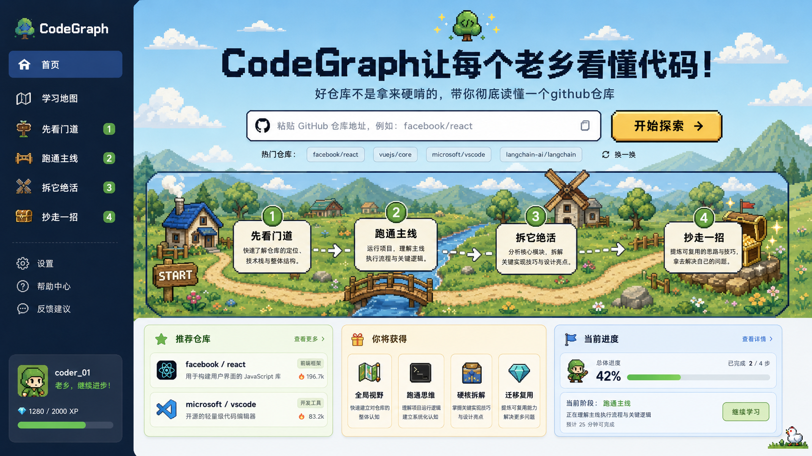
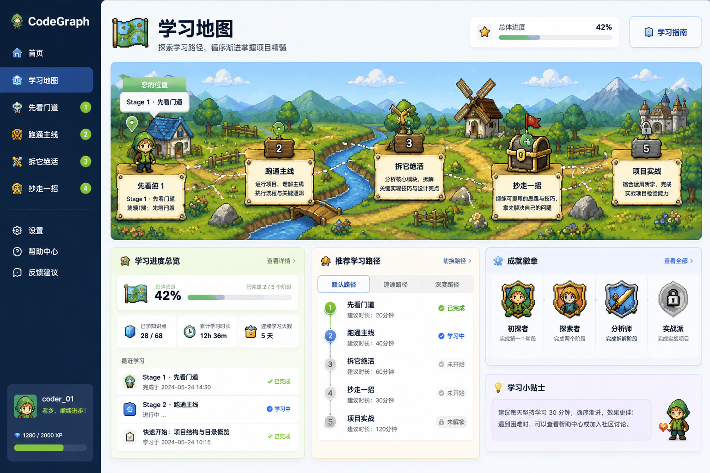
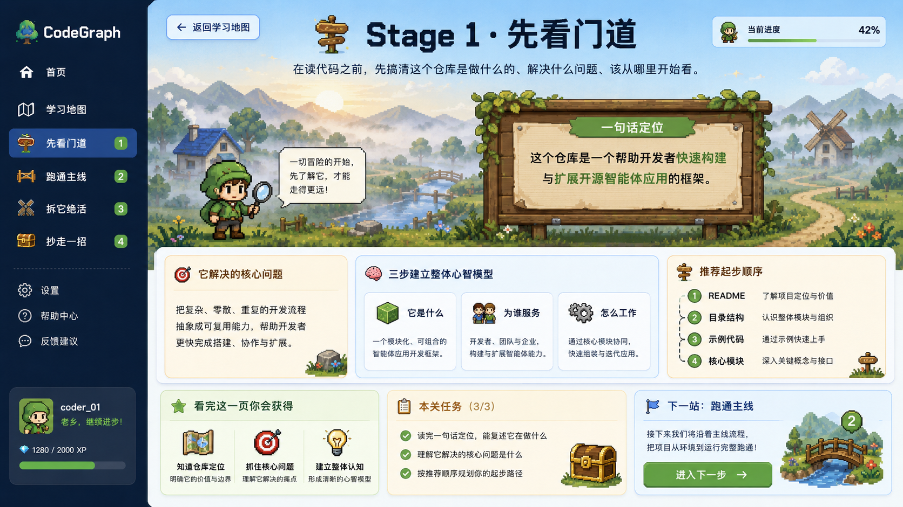
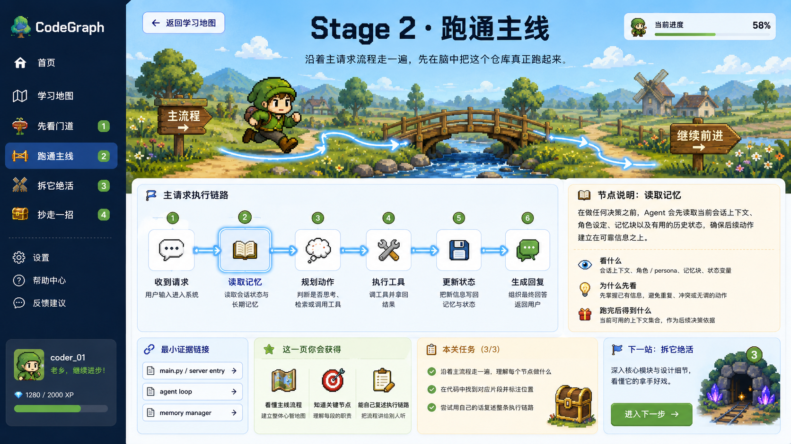
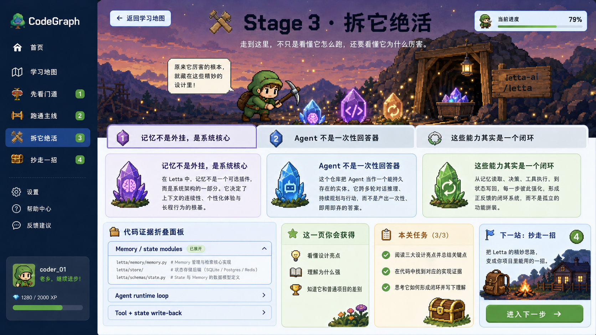
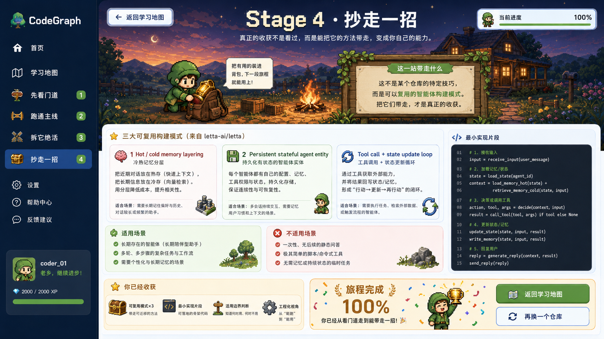

# CodeGraph

<div align="center">
  
  
  <h3>🎮 把复杂 GitHub 仓库变成一条可探索的学习旅程</h3>
  
  <p>
    
    
    
    
    
  </p>

  <p>
    <a href="./README.md">English</a> · <a href="./README.zh.md">中文</a>
  </p>
</div>

---

## 为什么做 CodeGraph？

**学习优秀开源项目很难。**

你打开 `facebook/react` 或 `langchain-ai/langchain`，2000+ 文件扑面而来。README 只讲怎么用，没说怎么读。从哪开始？哪些模块重要？调用链怎么走？核心设计在哪？

传统方式是：
- 硬啃 README → 迷失在文件树里
- 搜索关键词 → 碎片化，建立不了全局认知
- 问 ChatGPT → 回答泛泛，不理解你卡在哪

**CodeGraph 的答案：把仓库变成一条有导游的学习路径。**

不是把代码塞进向量库让你自己问，而是**用 Multi-Agent 系统先拆解仓库**，再把结构化的认知打包成 4 个阶段，带你从全局认知 → 跑通主线 → 拆解绝活 → 沉淀方法。

---

## 学习旅程设计

CodeGraph 把复杂仓库拆成 4 个闯关式学习阶段：

| 阶段 | 目标 | 你会得到什么 |
|------|------|-------------|
| **① 先看门道** | 快速建立全局认知 | 项目定位、技术栈、架构三件套、关键模块目录 |
| **② 跑通主线** | 理解核心执行流程 | 入口文件、主流程调用链、关键逻辑拆解 |
| **③ 拆它绝活** | 拆解值得偷的设计 | 核心实现模式、抽象设计、工程技巧、关键权衡 |
| **④ 抄走一招** | 迁移到自己项目 | 可复用的实践卡片、迁移场景、代码模板 |

**这不是文档生成器，是学习路径生成器。**

---

## Multi-Agent 架构：为什么不是传统 RAG？

CodeGraph 的核心是 **4-stage Agent 编排系统**，而非简单的 RAG 问答。

### Agent vs RAG 对比

| 维度 | 传统 RAG | CodeGraph Multi-Agent |
|------|----------|----------------------|
| **工作流** | Query → 检索 → 生成 | Query → **规划** → **工具选择** → **并行执行** → **上下文传递** |
| **协作** | 单轮对话，无状态 | 4-stage 编排，显式上下文传递 |
| **并行** | 无 | MainFlow + Showcase 并行分析 |
| **容错** | 失败即停 | 错误隔离，单 Agent 失败不影响其他 |
| **可观测** | 黑盒 | 完整 Trace（工具调用 + 推理过程 + 依赖图） |

### 系统架构

```
用户输入 GitHub URL
        ↓
  ┌──────────────┐
  │ Orchestrator │  ← 协调 4 个 Agent，管理上下文传递
  └──────┬───────┘
         │
    ┌────┴────┐
    ↓         ↓
┌─────────┐ ┌─────────┐
│Overview │ │MainFlow │  ← 并行执行
│  Agent  │ │  Agent  │
│ 先看门道 │ │ 跑通主线 │
└────┬────┘ └────┬────┘
     │           │
     └─────┬─────┘
           ↓
    context passing
      (architectureSummary → flowNodes)
           │
           ↓
    ┌──────────┐
    │ Showcase │
    │  Agent   │  ← 基于前面的输出深入分析
    │ 拆它绝活  │
    └─────┬────┘
          │
          ↓
   ┌──────────┐
   │ Takeaway │
   │  Agent   │  ← 提炼可复用方法
   │ 抄走一招  │
   └──────────┘
          │
          ↓
      15+ Tools
   (架构检测/调用图/
    模式匹配/测试关联...)
```

**核心特性：**
- ✅ **显式编排**：OverviewAgent 输出 → 下游 Agent 输入（非隐式 prompt 拼接）
- ✅ **并行加速**：MainFlow 和 Showcase 同时分析（节省 40% 时间）
- ✅ **失败隔离**：单个 stage 错误 → 降级为 error stub，其他继续
- ✅ **工具生态**：15+ 专用工具（架构检测、调用图追踪、模式匹配、README 摘要...）
- ✅ **完整 Trace**：记录每个 Agent 的推理过程、工具调用、执行时间、依赖关系

---

## 界面预览

### 首页：输入仓库，开始探索



### 学习旅程地图：4 阶段可视化路径



### 四个学习阶段页面

<table>
  <tr>
    <td width="50%">
      
      <p align="center"><strong>① 先看门道</strong> - 快速建立全局认知</p>
    </td>
    <td width="50%">
      
      <p align="center"><strong>② 跑通主线</strong> - 理解核心执行流程</p>
    </td>
  </tr>
  <tr>
    <td width="50%">
      
      <p align="center"><strong>③ 拆它绝活</strong> - 拆解值得偷的设计</p>
    </td>
    <td width="50%">
      
      <p align="center"><strong>④ 抄走一招</strong> - 迁移到自己项目</p>
    </td>
  </tr>
</table>

---

## 技术亮点

### 1. Multi-Agent 编排系统

```python
# 核心编排逻辑
class AnalysisOrchestrator:
    async def analyze_repo(self, repo_url: str) -> dict:
        # Stage 1: Overview (先看门道)
        overview = await self.overview_agent.run(context)
        context["architectureSummary"] = overview["architectureSummary"]
        
        # Stage 2 & 3: Parallel execution (跑通主线 + 拆它绝活)
        mainflow, showcase = await asyncio.gather(
            self.mainflow_agent.run(context),
            self.showcase_agent.run(context)
        )
        
        # Stage 4: Takeaway (抄走一招)
        context["flowNodes"] = mainflow["flowNodes"]
        context["highlights"] = showcase["highlights"]
        takeaway = await self.takeaway_agent.run(context)
        
        return {
            "overview": overview,
            "mainflow": mainflow,
            "showcase": showcase,
            "takeaway": takeaway,
            "_traces": self._collect_traces()  # 完整执行轨迹
        }
```

### 2. 工具执行透明化

每个工具调用都被追踪：

```python
# 自动统计
tool_stats_collector.record_call(
    tool_name="architecture_detector",
    duration_ms=245.7,
    success=True,
    agent_name="overview"
)

# 查询 API
GET /api/v1/agent/tools/stats
→ {
    "top_tools": [
        {"tool_name": "fetch_readme", "call_count": 847, "avg_duration_ms": 120.5},
        {"tool_name": "parse_tree", "call_count": 682, "avg_duration_ms": 89.2}
    ],
    "dependency_graph": {
        "architecture_detector": ["fetch_readme", "parse_tree"],
        "call_graph_tracer": ["find_entry_points", "trace_calls"]
    }
}
```

### 3. Graph-Enhanced RAG

不只向量检索，结合图遍历理解代码结构：

- **Neo4j 知识图谱**：函数调用链、依赖关系、概念图
- **混合检索**：图遍历 + 向量相似度 + 关键词匹配
- **结构化召回**：优先召回"被当前函数调用"的代码，而非"语义相似"的无关代码

---

## 快速开始

### 环境要求

- Python 3.11+
- Node.js 18+
- Docker & Docker Compose
- Claude API Key（或其他 OpenAI 兼容 API）

### 1. 克隆项目

```bash
git clone https://github.com/liu66-qing/CodeGraph.git
cd CodeGraph
```

### 2. 配置环境

```bash
cp .env.example .env
# 编辑 .env，填入 API Key
```

### 3. 启动服务

```bash
# 启动基础设施（Neo4j + Redis）
docker-compose up -d

# 启动后端
pip install -e ".[dev]"
uvicorn codegraph.main:app --reload --port 8000

# 启动前端
cd frontend
npm install
npm run dev
```

访问 `http://localhost:5173`，输入 GitHub 仓库地址开始探索。

---

## 项目结构

```
CodeGraph/
├── frontend/              # React + Vite 前端
│   ├── src/pages/         # 6 个页面（Home + Map + 4 Stages）
│   └── src/components/    # Pixel UI 组件
├── src/codegraph/         # FastAPI 后端
│   ├── agent/             # Multi-Agent 系统
│   │   ├── analysis_orchestrator.py   # 4-stage 编排器
│   │   ├── stages/        # 4 个 Stage Agent
│   │   ├── tools/         # 15+ 专用工具
│   │   └── tools/stats.py # 工具执行统计
│   ├── api/v1/            # REST API
│   ├── graph/             # Neo4j 图谱操作
│   ├── retrieval/         # Graph-Enhanced RAG
│   └── ingestion/         # 代码解析与入库
├── docs/design/           # PRD + 原型图
└── tests/                 # 单元测试 + 集成测试
```

---

## 适合谁？

- **学习者** - 想快速读懂大型开源项目（React/Vue/LangChain...）
- **团队负责人** - 想为团队沉淀代码学习路径
- **开发者** - 想研究 Multi-Agent + Graph RAG 在代码理解场景的落地
- **研究者** - 想探索 Agent 编排、工具调用、知识图谱的工程实践

---

## Roadmap

- [ ] 支持更多语言（目前专注 TypeScript/JavaScript/Python）
- [ ] Agent 推理过程可视化（实时 Trace 渲染）
- [ ] 工具依赖图交互式探索
- [ ] 学习路径导出（PDF/Markdown）
- [ ] 团队协作：多人共同学习一个仓库

---

## License

Apache-2.0 License - 详见 [LICENSE](./LICENSE)

---

<div align="center">
  <p><strong>CodeGraph: 让每个老乡看懂好仓库</strong></p>
  <p>如果这个项目帮到了你，点个 ⭐ Star 支持一下！</p>
</div>
